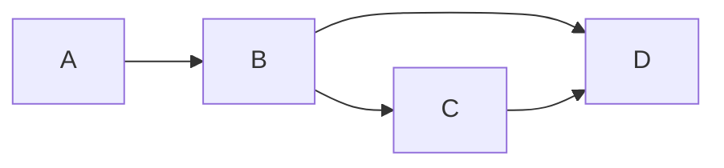

# Handling stale data in a journey

As the user goes through your service, data will be accumulating the JourneyContext.

If your Plan has any conditional routes, then there's a good chance that some of that data will become _stale_ as the user changes their mind and takes different paths through the Plan.

There are some important things to understand about how this stale data affects your service ...


## Going backwards

When a user lands on a page, the _back_ link you see at the top is generated by looking backwards through the Plan, starting at the waypoint the user is on.

For example, let's consider what the back link on `D` would be in the following Plan:



* If the user travels `A -> B -> D`, then the back link will point to `B`
* If the user travels `A -> B -> C -> D` then the back link will point to `C`
* If the user travels `A -> B -> D`, but then changes their mind and takes the `A -> B -> C -> D` route, then we run into a problem ...

Both the `D -> B` and `D -> C` back routes are valid, because both `B` and `C` contain validated data. So how does CASA decide which to choose?

There are 4 options:

1. Do nothing (the default behaviour). No back link will be generated and a warning will be logged.
2. Attempt automatic arbitration. CASA will traverse forwards from the start of the Plan and determine which of `B` or `C` are present.
3. Perform custom arbitration. You provide a function that performs the arbitration process.
4. Purge data from unvisited waypoints.

### Option 1: Do nothing

```javascript
// Applicartion config
new Plan();

// Example of using it directly
plan.traversePrevRoutes(journeyContext);
```

Traversal will stop at the first point where mutliple choices are present.

### Option 2: Automatic arbitration

```javascript
// Plan config
new Plan({
  arbiter: 'auto',
});

// Example of using it directly
plan.traversePrevRoutes(journeyContext, {
  arbiter: 'auto',
});
```

For smaller services with fewer waypoints, this is a good bet. However, for larger services, or more complex routing logic, this can potentially be an expensive operation as it needs to scan from the very start of the Plan.

### Option 3: Custom arbitration

```javascript
// Plan config
new Plan({
  arbiter: (target, options) => {
    // Reduce `targets` array to one element and return. If neither looks good,
    // return the original targets `targets`
  },
});

// Example of using it directly
plan.traversePrevRoutes(journeyContext, {
  arbiter: () => {},
});
```

This gives you the opportunity to decide which route is best to take.

### Option 4: Purge unvisited data

```javascript
// Run this at an appropriate place in the request lifecycle; perhaps in a
// global `journey.postgather` hook.
configure({
  hooks: [{
    hook: 'journey.postgather',
    middleware: (req, res, next) => {
      const traversed = plan.traverse(req.casa.journeyContext);
      const all = plan.getWaypoints();
      const toPurge = all.filter(e => !traversed.includes(e));
      req.casa.journeyContext.purge(toPurge);
      req.session.save(next);
    },
  }],
});
```

This is a neat option for those that aren't bothered about retaining data for waypoints that no longer feature in the user's journey. However, be careful where and when you use this as you may wipe out data that could actually be beneficial to the user's journey, i.e. they might revisit those waypoints and would be better to have kept the data. Or if you're using the JourneyContext to store non-page, "hidden" data, that will also get wiped out. Also, if you're using multiple Plans, be mindful of how a change to the context might affect those Plans.
