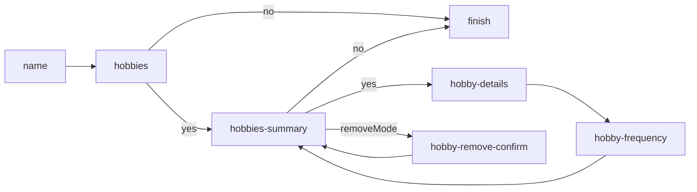

# Ephemeral Journey Contexts

Occasionally you may want a visitor to be temporarily ushered down a route without affecting the state of their core Journey Context.

**Ephemeral Contexts** are instances of the `JourneyContext` class, and offer a way for the user to temporarily change contexts during their journey, and thus go down a different path.

Once created, the data held against _any_ waypoint may be edited in that Ephemeral Context without modifying the original `default` Journey Context.

## Overview

Ephemeral Contexts are activated by passing a `contextid` URL parameter to any waypoint URL. The context referenced by that parameter must exist in the current session; if not, the default Journey Context instance will be used (id = `default`).

Once a context is set as active, it cannot be changed during the rest of the request handling, because the `req.[casa|session].journeyContext` references will be set on stone.

The `req.casa.journeyContext` object is a references to the _active context_, whether that is an Ephemeral Context, or the default Journey Context. Under the hood, CASA stores all contexts in `req.session.journeyContextList` (do not access this directly).

## Usage

To create an Ephemeral Context, it must be derived from an existing Journey Context (usually the `default`), and saved back to the session. For example, something like this might be used in a page hook, or some custom middleware:s

```javascript
// Create a new context from the currently active one.
// This will have a unique identifier, stored in its `id` attribute.
const myEphemeralContext = JourneyContext.fromContext(req.casa.journeyContext);

// Optionally, give the context a unique name so you can retrieve it specifically
// This is for internal use only. End users should only see context IDs in URLs.
myEphemeralContext.name = 'my-context';

// Optionally, attach some identifying tags so you can group contexts together
myEphemeralContext.identity.tags = [ 'group1' ];

// Store in session library
// This may throw an exception if there are any name clashes
JourneyContext.putContext(req.session, myEphemeralContext);

// Save session
req.session.save();
```

This context can now be activated on any _subsequent_ requests by sending the user to a URL that includes the `contextid` URL parameter.

To prevent an Ephemeral Context from being used any further, it must be removed from the session. If you attempt to remove the currently active context, no changes will come into affect until the user makes a subsequent request. For example:

```javascript
// Remove the context by instance (internally this uses the context id)
JourneyContext.removeContext(req.session, someContext);

// Remove the context by name
JourneyContext.removeContextByName(req.session, 'my-context');

// Remove the context by ID
JourneyContext.removeContextById(req.session, '4af7f4-df64-ff62bb90-d9a88c');

// Remove all contexts by tag
JourneyContext.removeContextsByTag(req.session, 'group1');

// Remove all contexts (except the default, which can never be removed)
JourneyContext.removeContexts(req.session);

// Save session
req.session.save();
```

If you want to make modifications to a context other than the currently active one, you can retrieve it from the session as so:

```javascript
// Retrieve a context by name
const otherContext = JourneyContext.getContextByName(req.session, 'my-context');

// Retrieve a context by id
const otherContext = JourneyContext.getContextById(req.session, '4af7f4-df64-ff62bb90-d9a88c');

// Retrieve contexts by tag
const otherContexts = JourneyContext.getContextsByTag(req.session, 'group1');

// Retrieve all contexts
const otherContexts = JourneyContext.getContexts(req.session);

// After making modifications, put back into session
JourneyContext.putContext(req.session, otherContext);

// Save session
req.session.save();
```


## Use case: Repetitive data capture ("looping")

In cases where you want to repeatedly send the user down a path to collect multiple instances of some data, Ephemeral Contexts can be put to use. Desribed below is a suggested pattern for achieving this.

In this example, we want to capture the details of an unlimited number of hobbies the visitor has.

Here's the outline of our Plan:



Implemented as so:

```javascript
const plan = new Plan();

plan.addSequence('name', 'hobbies');
plan.setRoute('hobbies', 'hobbies-summary', (r, c) => (c.data.hobbies.haveAnyHobbies === 'yes'));
plan.setRoute('hobbies', 'finish', (r, c) => (c.data.hobbies.haveAnyHobbies === 'no'));

plan.setRoute('hobbies-summary', 'hobby-details', (r, c) => (c.data['hobbies-summary'].anyMore === 'yes'));
plan.setRoute('hobbies-summary', 'finish', (r, c) => (c.data['hobbies-summary'].anyMore === 'no'));
plan.setRoute('hobbies-summary', 'hobby-remove-confirm', (r, c) => (c.data['hobbies-summary'].removeMode === true));
plan.setRoute('hobby-remove-confirm', 'hobbies-summary');

plan.addSequence('hobby-details', 'hobby-frequency', 'hobbies-summary');
```

The `hobbies-summary` page will include a list of edit/remove links (one for each hobby that has already been captured) and a question to ask if the user wants to add more. We'll create a suitable epehemeral context for each of these scenarios, and generate links that will acivate those contexts:

```javascript
pages['hobbies-summary'] = {
  hooks: {
    prerender: (req, res, next) => {
      // Remove any existing contexts, to avoid duplicates
      JourneyContext.removeContextsByTag(req.session, 'hobby-links');

      // Create new contexts for each hobby link
      res.locals.hobbies = req.casa.journeyContext.data['hobbies-summary'].hobbies.map((hobby, index) => {
        // Create a context for the "edit a hobby" mode
        const editContext = JourneyContext.fromObject(req.casa.journeyContext.toObject());
        editContext.data['hobbies-summary'].hobbyIndex = index;
        editContext.data['hobbies-summary'].anyMore = 'yes';
        editContext.removePages('hobby-details', 'hobby-frequency', 'hobby-remove-confirm');  // will remove all state for these pages
        JourneyContext.putContext(req.session, editContext);

        // Create a context for the "remove a hobby" mode
        const removeContext = JourneyContext.fromObject(req.casa.journeyContext.toObject());
        removeContext.data['hobbies-summary'].hobbyIndex = index;
        removeContext.data['hobbies-summary'].removeMode = true;
        removeContext.removePages('hobby-details', 'hobby-frequency', 'hobby-remove-confirm');  // will remove all state for these pages
        JourneyContext.putContext(req.session, removeContext);

        // Generate URLs to activate the edit/remove contexts for this hobby
        return {
          ...hobby,
          editLink: `hobby-details?contextid=${editContext.id}`,
          removeLink: `hobby-remove-confirm?contextid=${removeContext.id}`,
        };
      });

      // Persist all contexts to session
      req.session.save(next);
    },
  },
};
```

We'll also need a means to capture all these hobbies in one place in the main default Journey Context, for which we'll use a page hook on the final waypoint in the hobby gathering journey:

```javascript
// Once the last page in the "loop" is completed, update the "hobbies" list in 
// the core Journey Context with data captured in the active Ephemeral Context,
// and revert back to using the core context.
pages['hobby-frequency'] = {
  hooks: {
    postvalidate: (req, res, next) => {
      // These may be one and the same, but the logic still works
      const ephemeralData = req.casa.journeyContext.data;
      const defaultContext = JourneyContext.getContextByName(req.session, 'default');

      // Update or add to the hobbies list
      const hobby = { ...ephemeralData['hobby-details'], ...ephemeralData['hobby-frequency'] };
      const hobbyIndex = ephemeralData['hobbies-summary'].hobbyIndex;
      if (hobbyIndex !== undefined) {
        defaultContext.data['hobbies-summary'].hobbies[hobbyIndex] = hobby;
      } else {
        defaultContext.data['hobbies-summary'].hobbies.push(hobby);
      }

      // Remove the ephemeral context
      // This will only remove context from session if it is ephemeral.
      // Remember, it will still remain as the active context in req.casa.journeyContext
      // until the next request is made.
      JourneyContext.removeContext(req.session, req.casa.journeyContext);

      // Save the modified default context to the session
      JourneyContext.putContext(req.session, defaultContext);
      req.session.save(next);
    },
  },
};
```

To handle the removal of a hobby:

```javascript
pages['hobby-remove-confirm'] = {
  hooks: {
    postvalidate: (req, res, next) => {
      // These may be one and the same, but the logic still works
      const ephemeralData = req.casa.journeyContext.data;
      const defaultContext = JourneyContext.getContextByName(req.session, 'default');

      // Remove the hobby, if confirmed
      const hobbyIndex = ephemeralData['hobbies-summary'].hobbyIndex;
      if (ephemeralData['hobby-remove-confirm'] == 'yes') {
        defaultContext.data['hobbies-summary'].hobbies = defaultContext.data['hobbies-summary'].hobbies.splice(hobbyIndex, 1);
      }

      // Remove the ephemeral context
      JourneyContext.removeContext(req.session, req.casa.journeyContext);

      // Save the modified default context to the session
      JourneyContext.putContext(req.session, defaultContext);
      req.session.save(next);
    },
  },
};
```

We also need to consider the edit links in a "Check Your Answers" page. We _could_ just link back to the main `hobby-summary` are let the user use the edit/remove links on that page. However, in this example we'll replicate those edit/remove links on the "Check Your Answers" page:

```javascript
pages['check-your-answers'] = {
  hooks: {
    prerender: (req, res, next) => {
      // Remove any existing contexts, to avoid duplicates
      JourneyContext.removeContextsByTag(req.session, 'hobby-links');

      // Create new contexts for each hobby link
      res.locals.hobbies = req.casa.journeyContext.data['hobbies-summary'].hobbies.map((hobby, index) => {
        // Create a context for the "edit a hobby" mode
        const editContext = JourneyContext.fromObject(req.casa.journeyContext.toObject());
        editContext.data['hobbies-summary'].hobbyIndex = index;
        editContext.data['hobbies-summary'].anyMore = 'yes';
        editContext.removePages('hobby-details', 'hobby-frequency', 'hobby-remove-confirm');  // will remove all state for these pages
        JourneyContext.putContext(req.session, editContext);

        // Create a context for the "remove a hobby" mode
        const removeContext = JourneyContext.fromObject(req.casa.journeyContext.toObject());
        removeContext.data['hobbies-summary'].hobbyIndex = index;
        removeContext.data['hobbies-summary'].removeMode = true;
        removeContext.removePages('hobby-details', 'hobby-frequency', 'hobby-remove-confirm');  // will remove all state for these pages
        JourneyContext.putContext(req.session, removeContext);

        // Generate URLs to activate the edit/remove contexts for this hobby
        return {
          ...hobby,
          editLink: `hobby-details?contextid=${editContext.id}`,
          removeLink: `hobby-remove-confirm?contextid=${removeContext.id}`,
        };
      });

      // Persist all contexts to session
      req.session.save(next);
    },
  },
};
```
